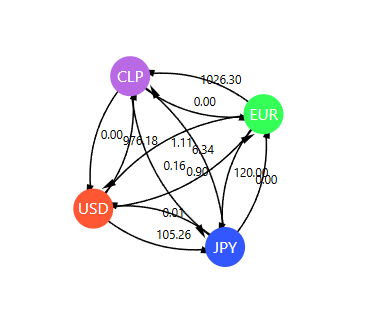

# Foreign exchange market oportunities
An application for the foreign exchange market using Bellman-Ford algorithm with the objective of identifying arbitrage opportunities.

# What's the Math behind the scene?
Suppose we are individual who want to gain from an arbitrage opportunity. Check this example:

We have 3 differents currencies: USD, EUR and JPY. Between these currencies, there exists exchanges rates, so we want to invest an amount $x$ for get some $x + y$, where we hope that $y$ will be a fraction of $x$ or more.

Imagine these exchange rates:
* 1 USD = 0.9 EUR
* 1 EUR = 120 JPY
* 1 JPY = 0.0092 USD

We can convert these rates to negative logarithms to simplify the mathematics, because it's better to sum than to multiply:
* $USD \rightarrow EUR: -log(0.9)$
* $EUR \rightarrow JPY: -log(120)$
* $JPY \rightarrow USD: -log(0.0092)$

If the sum of all these values is negative, we can execute a sequence of foreign exchange that can generate a net gain. In this case, we can use the Bellman-Ford (BF) algorithm to detect that negative cycle. If the cycle sum is negative, we know that we have an arbitrage opportunity.

Being more explicit with the example:

$$0.9_{\frac{USD}{EUR}}  \cdot 120_{\frac{EUR}{JPY}} \cdot 0.0092_{\frac{JPY}{USD}} = 0.9936 < 1 \rightarrow \text{no arbitrage opportunity}$$

using logarithms:

$$-log(0.9_{\frac{USD}{EUR}})  \cdot -log(120_{\frac{EUR}{JPY}}) \cdot -log(0.0092_{\frac{JPY}{USD}}) = 0.00296 > 0 \rightarrow \text{no arbitrage opportunity}$$

## A simple example

With a simple example, if we start with 100 USD:

$$100 \text{ USD} \cdot 0.9 = 90 \text{ EUR} \rightarrow 90 \text{ EUR} \cdot 120 = 10800 \text{ JPY} \rightarrow 10800 \cdot 0.0092 = 99.36 \text{ USD}$$

In the previous example, it's not advantageous to follow this path. But if we change the rates to reflect a market opportunity

$$100 \text{ USD} \cdot 0.9 = 90 \text{ EUR} \rightarrow 90 \text{ EUR} \cdot 120 = 10800 \text{ JPY} \rightarrow 10800 \cdot 0.0095 = 102.6 \text{ USD} \rightarrow \text{opportunity arbitrage!}$$

# General Equations
A currency is represented as $c_k$, where $k$ denotes the country under consideration. Here, $k \in K$ and $K$ is the set of currencies corresponding to different countries.

An arbitrage opportunity exists if:

$$\prod_{k=1}^{n} r_{c_k \rightarrow c_{k+1}} > 1$$

where:
* $r_{c_k \rightarrow c_{k+1}}$ is the exchange rate from currency $c_k$ to currency $c_{k+1}$
* $c_{n+1} = c_1$ to complete the cycle back to the starting currency
* $n$ is the number of exchanges in the cycle.

Alternatively, an arbitrage opportunity exists if:

$$\sum_{k=1}^n -ln(r_{c_k \rightarrow c_{k+1}}) < 0$$

* We can use $log(x)$ too.

# How can we connect to Bellman-Ford Algorihtm?
By assigning weights to the edges of the currency exchange graph as the negative logarithm of the exchange rates:

$$w_{c_k \rightarrow c_{k+1}} =  -ln(r_{c_k \rightarrow c_{k+1}})$$

So, an arbitrage opportunity exists if there is a negative cycle in the graph:

$$\sum_{k = 1}^n w_{c_k \rightarrow c_{k+1}} < 0$$

# Visualization of the problem: Complete Graph

  

# Tasks
* [Trello Activities](https://trello.com/b/g8V64xTz/forex-market-application)

# Technologies
* [d3.js](https://d3js.org/)
* [React](https://es.react.dev/)